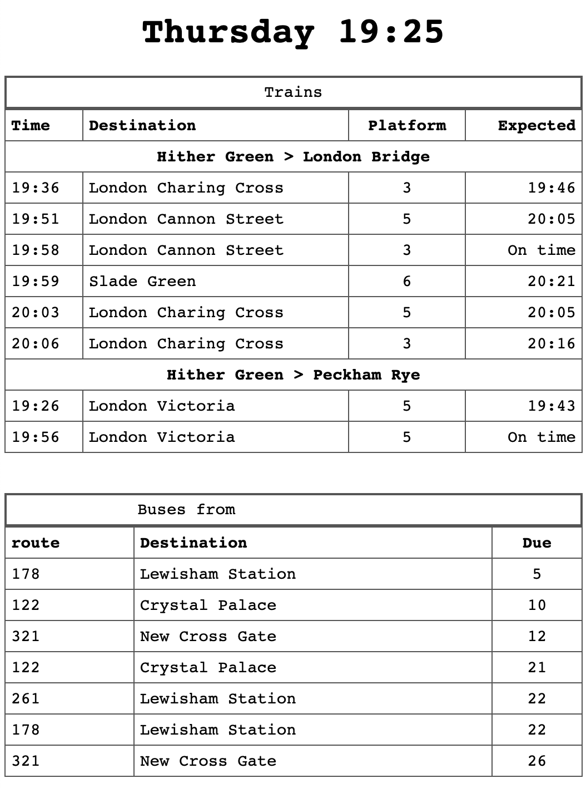

# travel - personal train and London bus times

Terence Eden has a cool project to turn a Nook e-reader into a personal display of the next useful trains and London buses to depart from near his home: https://shkspr.mobi/blog/2020/02/turn-an-old-ereader-into-an-information-screen-nook-str/ 

I thought I'd do something similar and would start with the PHP / web page end. I'll skip the Nook bit for now, and just bookmark this page on my phone so I have trains and buses on one page. It only shows trains with platforms allocated (i.e. that may run any time soon) more than 10 minutes in the future - to allow me time to get to the station - and buses more than 5 minutes away.

I had a few issues:
- I want to host it on my hosting company's server which is in a diffeeent time zone, so I had to add code to compensate for that
- It runs an ancient version of PHP and not all of Terence's code would work
- It really wasn't happy about slurping in the bus data from another site
- I wanted to add two different train routes from different stations as different people in our house have completely different journeys to make

So I cooked up a hideous kludge* that is half PHP, half-JavaScript. JavaScript seems to have no compunctions about slurping London bus data from TfL.

If you want to do something similar, the index.php file works for me with PHP version 5.3.16

You'll need to modify a few things to get it to work:
- get your own National Rail data API key from here and add it to index.php: http://realtime.nationalrail.co.uk/OpenLDBWSRegistration
- change the 3-letter station codes; the first should be your nearest station, the second where you want to go to
- use the CSV file to find the 'Naptan_Atco' code for your nearest bus stop and plug that in to the JavaScript section of the index.php
- modify the time offsets to only show trains you can catch
- modify 120 on line 236 (120 = 2 minutes) to equal how long it takes to walk to your bus stop 
- make sure the OpenLDBWS.php file is in the same directory as index.php

The buses are sorted in order of next arrival, but you could tidy this up by only showing each route once with the times for that bus.

